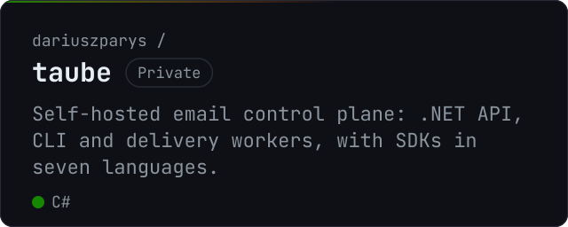
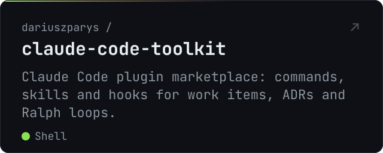
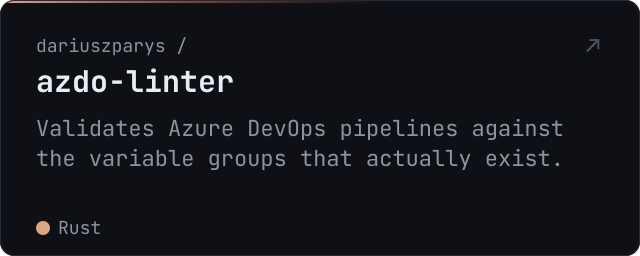

<picture>
  <source media="(prefers-color-scheme: dark)" srcset="assets/banner-dark.svg">
  <source media="(prefers-color-scheme: light)" srcset="assets/banner-light.svg">
  
</picture>

 

<picture>
  <source media="(prefers-color-scheme: dark)" srcset="assets/terminal-dark.svg">
  <source media="(prefers-color-scheme: light)" srcset="assets/terminal-light.svg">
  
</picture>

### `01` &nbsp;Currently building

<picture><source media="(prefers-color-scheme: dark)" srcset="assets/projects/taube-dark.svg"><source media="(prefers-color-scheme: light)" srcset="assets/projects/taube-light.svg"></picture>
<a href="https://github.com/dariuszparys/claude-code-toolkit"><picture><source media="(prefers-color-scheme: dark)" srcset="assets/projects/claude-code-toolkit-dark.svg"><source media="(prefers-color-scheme: light)" srcset="assets/projects/claude-code-toolkit-light.svg"></picture></a>
<a href="https://github.com/dariuszparys/azdo-linter"><picture><source media="(prefers-color-scheme: dark)" srcset="assets/projects/azdo-linter-dark.svg"><source media="(prefers-color-scheme: light)" srcset="assets/projects/azdo-linter-light.svg"></picture></a>
<a href="https://github.com/dariuszparys/gpsify"><picture><source media="(prefers-color-scheme: dark)" srcset="assets/projects/gpsify-dark.svg"><source media="(prefers-color-scheme: light)" srcset="assets/projects/gpsify-light.svg"></picture></a>

### `02` &nbsp;Latest writing

<!-- BLOG-POST-LIST:START -->
- [Three Gates Between a PDF and Your Storage Account](https://www.dariuszparys.com/three-gates-between-a-pdf-and-your-storage-account) · Nov 11, 2026
- [Writing for Agents](https://www.dariuszparys.com/writing-for-agents) · Nov 6, 2026
- [Planning and Running Coding Agents with Herdr](https://www.dariuszparys.com/planning-and-running-coding-agents-with-herdr) · Nov 2, 2026
- [Placebound: Archon in the Browser](https://www.dariuszparys.com/placebound-archon-in-the-browser) · Oct 28, 2026
- [Running a 2.5 hour job from a 60 minute pipeline: Azure Container Apps Jobs, kickoff and collect](https://www.dariuszparys.com/azure-container-apps-jobs-kickoff-and-collect) · Sep 1, 2026
<!-- BLOG-POST-LIST:END -->

→ more at <a href="https://www.dariuszparys.com">dariuszparys.com</a>

### `03` &nbsp;Contributor to

- [**Eclipse Chariott**](https://github.com/eclipse-chariott/chariott): a gRPC service that gives in-vehicle applications one common interface to talk to each other
- [**Rust for .NET developers**](https://microsoft.github.io/rust-for-dotnet-devs/latest/): learning Rust through the lens of C# and .NET

 

<picture>
  <source media="(prefers-color-scheme: dark)" srcset="assets/footer-dark.svg">
  <source media="(prefers-color-scheme: light)" srcset="assets/footer-light.svg">
  
</picture>
